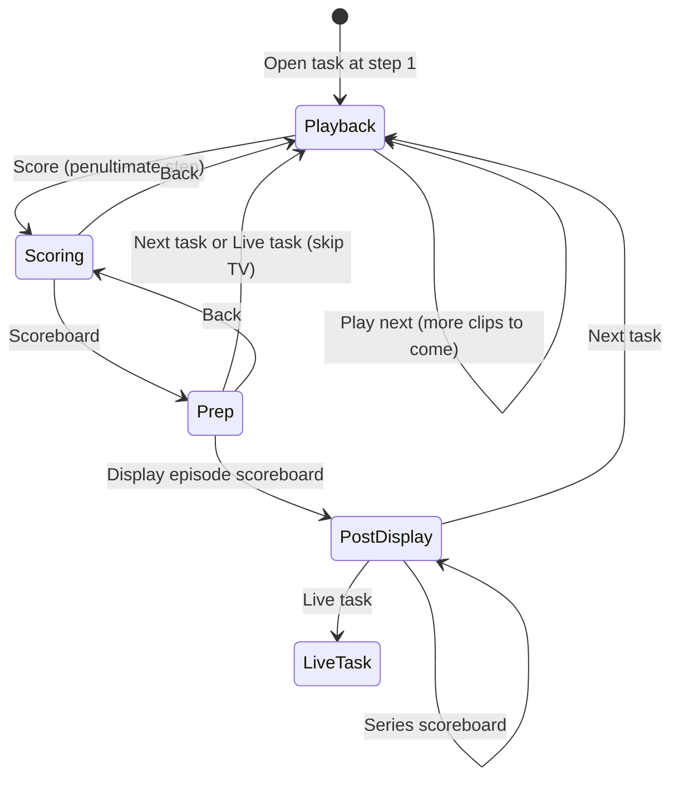

# Taskmaster Show Control System — Controller Design

This document defines the **Controller** application: the touch-screen operator UI ("Alex's iPad"), show-state management, and when each wire command is sent. Wire messages are in the [protocol design doc](protocol-design.md); system context and `results.json` format are in the [High-Level Design](high-level-design.md).

Visual mockups for a full studio task are in the [Controller worked example](controller-worked-example.md). Fixture step data: [fixtures/ep01-task01-results.json](fixtures/ep01-task01-results.json).

---

## 1. Role and constraints

The Controller is operated by the host on a **13″ Windows laptop**, folded flat as a touch screen. There is **no keyboard** during recording.


| Constraint              | Implication                                          |
| ----------------------- | ---------------------------------------------------- |
| Touch-only              | No typing. Scores use tappable 0–5 cells.            |
| 13″ landscape           | One screen, no scrolling in normal use.              |
| Accidental taps         | ≥ 56 px touch targets, ≥ 16 px gaps.                 |
| Operator watches the TV | Fire-and-forget commands; errors on Controller only. |


### Operator ahead of the TV

When Alex sends a command that starts media on the Viewer, the Controller **immediately** shows the next page Alex will need. The iPad is always ready for what comes next while the TV is still playing — Alex does not wait for a clip to finish before the UI advances.

The Viewer returns to idle when playback ends on its own; the Controller does not listen for a "clip finished" message.

Examples: **Play intro** → opening bit page at once; **Play next clip** → next step's text at once; **Outro** → home at once while `outro.mp4` plays.

The `TV:` indicator in the header ([§4](#4-studio-task-flow)) shows the Controller's model of the **last command it sent**, not a readback from the Viewer. Because the operator only moves the show on once the current clip has finished ([HLD §2, The operator paces the show](high-level-design.md#2-design-principles)), the TV has returned to idle by the time Alex advances past a video — so the indicator and the **Cancel playing** rule stay in step with the screen even though there is no clip-ended event.

### Connection status and recovery

A **connection indicator** sits in the top-right of the header on every page: `● Connected` (green) when the WebSocket to the Viewer is open, `● Disconnected` (red) otherwise. It is the operator's only signal about the link, since commands are fire-and-forget and success is silent.

If the socket drops, the Controller keeps its full show state (it lives on the Controller's disk, not the wire) and **reconnects automatically with backoff** ([protocol §4](protocol-design.md#4-connection-lifecycle)). Recovery needs almost nothing special: every command already names exactly what to show — **Play next clip** / **Play specific** send a specific clip path, a scoreboard command sends the numbers — so once the indicator goes green again the operator simply re-taps the action for whatever should currently be on the TV and the correct content reappears. There are no acknowledgements to reconcile and no partial state to resync; the Viewer just starts from idle and the next command paints the intended screen.

---

## 2. Task structure (`results.json`)

Every task (including `task00_prize`) has an ordered `steps` array. **Array order is the run order.** There is no fixed length; a contestant may appear in multiple clips.


| Field  | Required | Meaning                                                     |
| ------ | -------- | ----------------------------------------------------------- |
| `text` | yes      | Operator-facing note for this step (brief; no "who's next"). |
| `clip` | no       | Media filename without extension. Omit for text-only steps. |


**Displayed text:** the Controller shows `steps[i].text` as written. If the **next** step has a `clip`, append a blank line and `Next clip: <label>`. Not shown on the scoring page (the final step).

**The first step is always text-only** — it carries no `clip`. A clip plays only when advanced *into* from the previous step, so a clip on step 0 (shown on open) could never play ([HLD §5](high-level-design.md#tasks-clips-and-resultsjson)). Beyond that, **text-only steps are optional**: they are operator notes and send nothing to the Viewer when advanced past. By convention the first step briefs the task and the last step lists the overall rankings.

**The last step is the scoring page.** The final step in the array is always where the score pickers appear, regardless of its content ([§4.2](#42-scoring)). It may carry a `clip` (e.g. a recap still or montage); that media is shown/played when **Score** is tapped, not skipped.

**Footer primary button (playback):** **Play next clip** on every step before the penultimate one; **Score** on the **penultimate** step, because tapping it advances to the final step, which is the scoring page.

---

## 3. Episode entry and exit

### 3.1 Home — episode picker

The app opens on a **home** page:

- **Series standings** — current season totals, ranked 1st to last (read-only).
- **Episode list** — one row per episode in the catalogue.

**Default:** tap an episode name → **episode intro** page ([§3.2](#32-episode-intro-page)).

**Jump (optional):** each episode row expands to list its segments (`task00_prize`, `task01`, …, **Live task**). Tapping a segment opens that task directly (or the live task page), for rehearsals or picking up mid-episode. No intro sequence.

### 3.2 Episode intro page

Single button: **Play intro** → `show_media` → `episodes/<id>/intro.mp4`, and the Controller **immediately** opens the **opening bit** page ([§3.3](#33-opening-bit-page)). Alex does not use the iPad while the intro plays. When the intro ends, the Viewer returns to idle; the Controller stays on the opening bit page.

### 3.3 Opening bit page

Shows the episode's `opening_bit` text from the cached catalogue (operator notes for the opening joke / studio setup; sourced from `episodes/<id>/opening-bit.json` on the Viewer). Not shown on the TV.

Footer: **Prize task** → opens `task00_prize` at step 1 (playback).

### 3.4 End of episode — outro

After the **live task** is scored ([§5](#5-live-task)), **Outro** replaces **Next task** / **Live task** on prep (once the episode scoreboard has been shown) and on post-display.

**Outro** → `show_media` → `episodes/<id>/outro.mp4`, and the Controller **immediately** returns to **home** ([§3.1](#31-home--episode-picker)). When the outro ends, the Viewer returns to idle.

Studio tasks use **Next task** or **Live task** on prep/post-display when another segment follows ([§4.5](#45-scoreboard-branches)).

---

## 4. Studio task flow

Each pre-recorded task (`task00_prize`, `task01`, …) uses up to four pages during playback and scoring.




| Page | When | Footer |
| ---- | ---- | ------ |
| **Playback** | Before the final step | **Play next clip** or **Score** |
| **Scoring** | Final step | **Scoreboard** only |
| **Prep** | After **Scoreboard** | **Next task** or **Live task**, and **Display episode scoreboard** |
| **Post-display** | After episode scoreboard on TV | **Next task** or **Live task**, and optional **Series scoreboard** |

**Header:** `Ep … · Task … · Step X of Y · TV: …` (abbreviate clip names). On prep / post-display / live task, replace the step slot with the page label (`Scoreboard prep`, `On screen`, `Live task`).

**Display names** are derived from ids, not stored titles: an episode id `epNN` renders as `Ep NN`; a task id containing `_prize` renders as **Prize task** and the live segment as **Live task**; any other task id `taskNN` renders as `Task NN`. This same rule drives the home-page episode/segment list ([§3.1](#31-home--episode-picker)).

**Footer (playback & scoring):** Back and Play specific always available. **Back** is iPad-only navigation — it moves the Controller to the previous page and never sends a wire command or changes what is on the TV. **Cancel playing** whenever the TV is showing media — not on step 1 (idle); on the scoring page it appears only when the final step carries a `clip` (so a recap still can be cleared).

### 4.1 Playback

Shows the current step's text (plus **Next clip** when the next step has media — see [§2](#2-task-structure-resultsjson)).

**Play next clip** advances one step and sends `show_media` if that step has a `clip`. If the advanced-to step is a **random intro** (the catalogue marks it `random_intro`), the Controller first picks a clip at random from the catalogue's `intros` pool and sends that path; a task with its own intro file or a named `intro` override already carries a fixed `path` and is sent as-is. The random pick is not persisted, so re-tapping after a reconnect may choose a **different** sting — any intro is acceptable, so this is fine.

**Score** advances to the final step (scoring page). Shown on the penultimate step. If the final step has a `clip`, Score also sends `show_media` for it — the recap still or video appears on the Viewer while Alex scores; it is not skipped.

### 4.2 Scoring

Final step (scoring page) — the step's `text` (by convention the overall rankings from `results.json`) plus score pickers (0–5 per contestant). Alex uses the overall text to decide points; if the final step has no text the pickers stand alone. If the final step has a `clip` (e.g. a recap image of all five entries), it is shown/played on the TV when Score is tapped and follows normal media rules — a still stays until the next command, a video plays once then returns to idle.

Footer: **Scoreboard** only (no skip here — skipping the TV scoreboard is done from prep).

**Play specific** jumps to any clip, earlier or later; layout follows whichever step Alex is on.

### 4.3 Scoreboard prep

Opened by **Scoreboard** from scoring. Read-only **episode totals**, ranked 1st to last, so Alex can read them out before putting them on the TV.

Footer: **Next task** or **Live task** (if no further studio task), and **Display episode scoreboard**.

- **Next task** / **Live task** — **fold** this task's scores into the episode totals (`previous_totals += task_scores`, then `task_scores` reset to 0), clear the TV, open the next segment. No scoreboard animation (0 on TV).
- **Display episode scoreboard** — send `show_leaderboard` with `previous` = the totals *before* this task and `current` = those totals plus this task's scores, then open post-display (1 on TV). The fold-in is **not** applied here — that would make `previous` equal `current` and kill the animation — so it is deferred until Alex leaves the task via **Next task** / **Live task**. Re-showing therefore animates identically each time.

### 4.4 Post-display

After **Display episode scoreboard**. Series standings on the Controller (ranked 1st to last). TV shows the episode scoreboard.

Footer: **Next task** or **Live task**, and **Series scoreboard** (optional → 2 on TV).

Leaving via **Next task** / **Live task** applies the fold-in described in [§4.3](#43-scoreboard-prep). **Series scoreboard** sends `show_series_leaderboard` with both values **derived from the episode files** — `current` = the sum of every episode's combined totals, `previous` = that same sum excluding the episode currently open. Nothing is persisted or committed, so re-showing derives the identical pair and animates the same way each time — see [High-Level Design §5](high-level-design.md#scores).

No **Back** button — forward only.

### 4.5 Scoreboard branches

Every scored studio task goes **Scoring → Prep**. From prep, Alex chooses how many scoreboards hit the TV before moving on:

| TV scoreboards | Path | Buttons |
| -------------- | ---- | ------- |
| **0** | Skip display | Prep → **Next task** / **Live task** |
| **1** | Episode only | Prep → **Display episode scoreboard** → post-display → **Next task** / **Live task** |
| **2** | Episode + series | As 1, then **Series scoreboard** on post-display → **Next task** / **Live task** |

On post-display, **Next task** advances to the next studio task (step 1). **Live task** appears instead when the episode has no further studio tasks ([§5](#5-live-task)).

See [Controller worked example](controller-worked-example.md) for mockups.

---

## 5. Live task

The live task is the last segment of an episode — filmed in the studio after all pre-recorded tasks. **Every episode has exactly one live task**, so this segment always runs before the outro.

### 5.1 Live task page

Opened by **Live task** from prep or post-display when there is no next studio task.

- Reminder text from the episode's `live_task` in the cached catalogue (sourced from `episodes/<id>/live-task.json` on the Viewer).
- **100 s countdown** (Controller only) — starts when Alex taps **Start countdown**. 100 s is a season-wide constant; `live-task.json` carries no per-task duration.

Footer: **Score** (available before or after the countdown).

### 5.2 Live task scoring

Same layout as studio scoring ([§4.2](#42-scoring)) but **no overall-rankings text** — score pickers only.

Footer: **Scoreboard** → prep ([§5.3](#53-live-task-scoreboard-prep)).

### 5.3 Live task scoreboard prep

Alex **must** put the episode scoreboard on the TV — skipping it is not offered.

**Before** the episode scoreboard has been shown this round:

Footer: **Display episode scoreboard** only.

**After** the episode scoreboard has been shown:

Footer: **Outro**, and **Display episode scoreboard** (to re-show if needed).

Alex may skip the **series** scoreboard by tapping **Outro** from prep (after the episode board has been shown) or from post-display.

### 5.4 Live task post-display

After **Display episode scoreboard**. Same as studio post-display but **Outro** instead of **Next task** / **Live task**, plus optional **Series scoreboard**.

Tapping **Outro** applies the same fold-in as leaving any task ([§4.3](#43-scoreboard-prep)); because the live task is the last task, the episode totals are now final and equal the episode's contribution to the series ([High-Level Design §5](high-level-design.md#scores)).

No **Back** button — forward only.

---

## 6. `task00_prize`

Same pages and step model as other tasks. Folder: `tasks/task00_prize/`.


| Difference     | Detail                                  |
| -------------- | --------------------------------------- |
| Header         | **Prize task** instead of task id       |
| Media          | Stills (`.jpg`) via `show_media`        |
| Cancel playing | Emphasised — clears a still from the TV |


---

## 7. Episode progression

```
Home → episode intro → opening bit → task00_prize → task01 → … → live task → outro → Home
```

---

## 8. Episode metadata (Viewer media)

| File | Location | Purpose |
| ---- | -------- | ------- |
| `opening-bit.json` | `episodes/<id>/` | Text for the opening bit page after intro |
| `live-task.json` | `episodes/<id>/` | Reminder text on the live task page |

Both files are `{ "text": "…" }` and are **required in every episode** — every episode has an opening bit and a live task ([§5](#5-live-task)). The Controller never reads the Viewer's disk; instead the Viewer inlines both into the catalogue as the `opening_bit` and `live_task` objects on each episode ([protocol §6.1](protocol-design.md#61-catalogue)). The Controller reads them from its cached catalogue.

---

## 9. Persistence

`episodes/<id>/show_state.json` stores exactly two score sets — **`previous_totals`** (running totals up to but not including the current task) and **`task_scores`** (the current task only) — plus the operator's place in the episode. A contestant's combined total is `previous_totals + task_scores`; see [High-Level Design §5](high-level-design.md#scores) for the fold-in and series rules.

```json
{
  "segment": "task01",
  "step_index": 4,
  "ui_page": "scoring",
  "previous_totals": { "taylor": 4, "max": 2, "charlie": 5, "peter": 3, "harry": 1 },
  "task_scores":     { "taylor": 2, "max": 3, "charlie": 0, "peter": 5, "harry": 1 }
}
```

Here the prize task has already been folded into `previous_totals` (`Charlie 5, Taylor 4, Peter 3, Max 2, Harry 1`), and `task_scores` holds Task 01's points. Combined totals are therefore `Peter 8, Taylor 6, Charlie 5, Max 5, Harry 2` — the numbers the scoreboard-prep page reads out ([worked example](controller-worked-example.md)).

`segment`: the id of the current task (`task00_prize` | `task01` | `task02` | …) or `live_task` for the live segment.

`ui_page`: `home` | `episode_intro` | `opening_bit` | `playback` | `scoring` | `scoreboard_prep` | `post_display` | `live_task` | `live_scoring`

During the live task, `scoreboard_prep` and `post_display` are reused rather than given live-specific values; `segment == live_task` marks the live variants (which offer **Outro** in place of **Next task** / **Live task**, per [§5.3–§5.4](#53-live-task-scoreboard-prep)).

---

## 10. Wire commands


| Action                                 | Command                            |
| -------------------------------------- | ---------------------------------- |
| Play intro / outro                     | `show_media`                       |
| Play next / Play specific (media step) | `show_media`                       |
| Score (when the final step has a clip) | `show_media`                       |
| Cancel playing                         | `background`                       |
| Display episode scoreboard             | `show_leaderboard`                 |
| Series scoreboard (post-display)       | `show_series_leaderboard`          |
| Next task / Live task / Outro (clear)  | `background`, then advance segment |


---

## 11. Touch targets

Footer buttons ≥ 56 px tall, 16 px apart. Score cells ≥ 48 × 48 px. **Next task**, **Live task**, **Outro**, **Start countdown**, **Display episode scoreboard**, and **Series scoreboard** ≥ 80 px tall.

---

## 12. Deferred

- Re-show scoreboard without walking back through prep
- Editable step text during recording
- Resume mid-clip on reconnect
