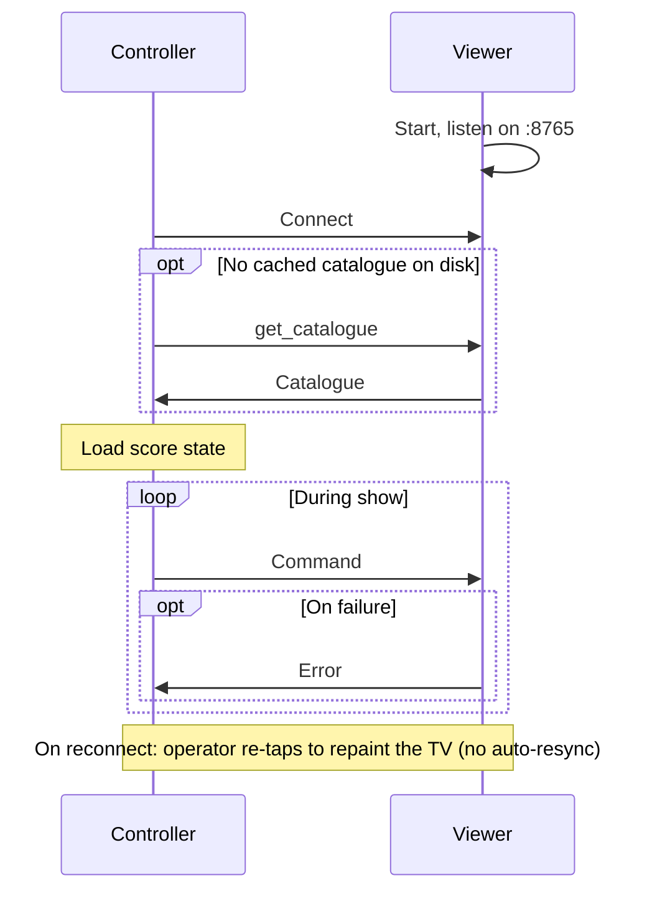
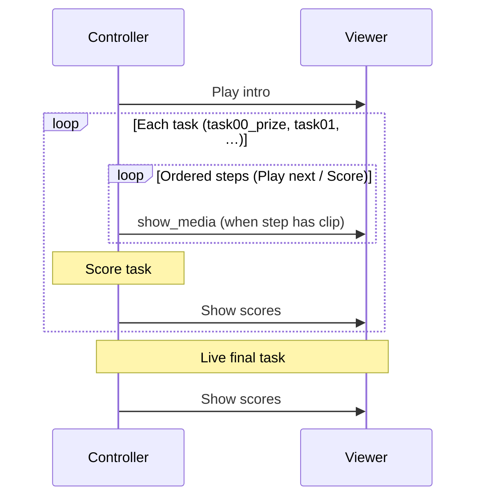
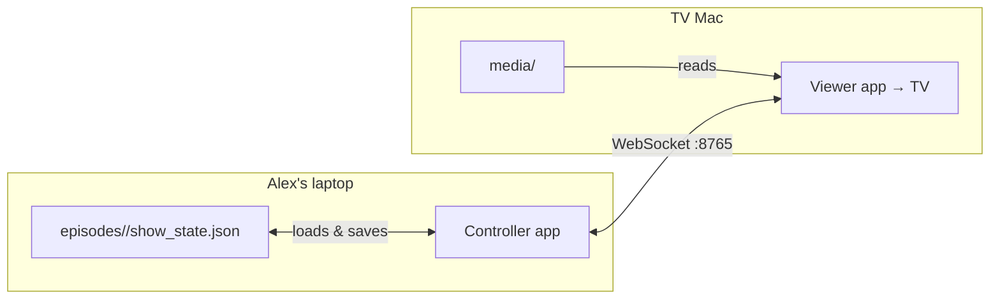

# Taskmaster Show Control System — High Level Design

## 1. Requirements

### Summary

This application replicates the functionality of the "Alex's iPad" used during the studio portions of Taskmaster.

The system consists of two desktop applications on a local network:

- **Controller** — operated by the host ("Alex"). It is private; only the operator sees it.
- **Viewer** — an application that plays media, displayed full-screen on the TV for the audience.

The Controller owns **runtime show state** (scores, progression, what's on screen). The Viewer renders commands and can describe its available content when the Controller asks.

### How a show runs

1. Start the Viewer, then the Controller.
2. The Controller connects and requests a **catalogue** from the Viewer if it does not already have one cached.
3. The operator runs through the episode in order: intro, `task00_prize`, then `task01`, `task02`, … — for each task, ordered steps via `results.json`, then score update. See [§3](#example-episode-flow).
4. During the show, the Viewer sends messages to the Controller only when something fails.

The system runs entirely offline on local WiFi. No internet connection is required during a show.

### Development and deployment

The repo is developed on one machine and copied to two for the show:

- `controller/` → Alex's Windows 11 laptop (folded back as the iPad)
- `viewer/` → Mac connected to the TV via HDMI (extended display)

Episode content is preloaded on the Viewer before recording. The Controller holds score state and a cached copy of the catalogue.

### Scope: one static season

This project targets one season with a fixed set of episodes, contestants, and media. The repo is expected to be largely static once complete. There is no need to support adding episodes mid-season, downloading clips on demand, or managing multiple concurrent seasons.

See [§2 Design Principles](#2-design-principles) for architectural rationale, including catalogue and messaging policy.

## 2. Design Principles

This section records the principles behind key decisions. If a future change conflicts with one of these, treat it as a deliberate trade-off.

### Viewer-first quality

The **Viewer** is what the audience sees, so animations, video, and the leaderboard must be correct and polished. The **Controller** only needs to be clear and usable by the operator; it does not need to look sleek, because nobody else will see it, but it does need to be correct and usable, because usability delays will be evident when the Viewer does not receive the right command at the right time.

### Controller commands, Viewer renders

All scoring, ordering, and show progression live in the Controller. The Viewer executes commands deterministically and never makes decisions on its own. The Controller always knows the current episode, task, scores, and what is on screen.

### Viewer owns content; Controller owns show state

Episode media and structure live on the Viewer; the Controller stores only mutable score state on its local disk. Commands reference media by path and the Viewer loads files locally — nothing is streamed or duplicated onto the Controller.

### Static content

The media tree is fixed for the season: everything the Viewer can display exists on disk before recording and does not change while the show runs. Content is read-only at show time, which is what lets the Controller treat the catalogue as a one-time lookup rather than live data (see [§6](#6-component-interactions)).

### Errors required, not acknowledgements

During a show, commands are fire-and-forget. The operator watches the TV, so a successful command needs no reply. The Viewer sends a message to the Controller only on failure — missing file, playback error, invalid state. The sole exception is a catalogue response to an explicit `get_catalogue` request at setup; that is not an acknowledgement of routine commands.

### The operator paces the show

The operator advances the show only once the current clip has finished on the TV. There is deliberately **no "clip-ended" event**: when a video ends the Viewer returns to the idle background on its own ([Viewer design](viewer-design.md)), and the Controller never learns that this happened. Everything that depends on "what is currently on the TV" — the `TV:` indicator in the Controller header, when **Cancel playing** is offered, and treating a text-only scoring step as idle after a video — rests on the assumption that Alex will not push the show ahead early. The `TV:` indicator is therefore the Controller's model of the **last command it sent**, not a confirmed readback. Trusting the operator's pacing is what keeps commands fire-and-forget and removes an entire class of playback-synchronisation state; it is a deliberate trade-off.

### Viewer hosts the WebSocket server

The Viewer listens on port `8765` and the Controller connects as a client when the operator is ready.

### Episodes as first-class units

Each episode is a recording session with its own tasks and scores in `episodes/<id>/show_state.json`. Series standings are **derived** from the episode files, not stored separately (see [§5](#scores)).

### Convention over configuration

Tasks and clips are discovered from the folder structure and filenames. Contestants are defined once for the whole season. **Playback order is not inferred from filenames** — it is defined explicitly in each segment's **`results.json`** as an ordered list of steps ([§5](#tasks-clips-and-resultsjson)).

## 3. High-Level Architecture

Both applications run on separate machines connected over local WiFi. The following sequence diagram shows **connect and reconnect**, and the high-level interactions between the applications.




### Example episode flow

Within this, a typical studio episode largely consists of the following command flows between the Controller and the Viewer. Note the sending of errors is omitted for brevity.




This matches the usual Taskmaster studio recording: prize task, pre-recorded tasks, live tasks, final leaderboard.

## 4. Technology Stack


| Layer       | Choice                         |
| ----------- | ------------------------------ |
| Language    | Python 3.12+                   |
| GUI         | PySide6 (Qt)                   |
| Networking  | WebSockets                     |
| Data format | JSON                           |
| Media       | Local files on the Viewer only |


---

## 5. Data & Content

Each application is a self-contained deploy unit, cloned to its target machine before recording. The Controller holds **score state** — one `show_state.json` per episode — that is liable to change, plus a cached copy of the Viewer's catalogue (`config/catalogue.json`). Series standings are derived from the episode files, so there is no season-level state file. The Viewer holds **static** **media** (clips, assets, and the season `contestants.json`). See [§2](#viewer-owns-content-controller-owns-show-state). Score state and media are not synced over the network at show time.




### Folder layout

```
controller/
  src/
  config/
    catalogue.json            # cached catalogue from the Viewer
    episodes/
      ep01/show_state.json    # per-episode scores; series totals derived from these
      ep02/show_state.json

viewer/
  src/
  media/
    contestants.json
    assets/
      backgrounds/
      scoreboard/           # portrait frame kit (vendored from VodBox)
      fonts/
      contestants/
      intros/
    series/                 # series-wide clips, shared by every episode
      intro.mp4             # opening titles
      outro.mp4             # closing sequence
      task-lead-in.mp4      # sting chained before each task's first video clip
    episodes/
      ep01/
        opening-bit.json      # operator notes for the opening bit (required)
        live-task.json        # reminder text for the live task (required)
        tasks/
          task00_prize/       # prize task (stills); same step model as other tasks
          task01/
          task02/
      ep02/
        ...
```


| Location                                      | Purpose                                |
| --------------------------------------------- | -------------------------------------- |
| `controller/config/catalogue.json`            | Cached catalogue fetched from the Viewer |
| `controller/config/episodes/<id>/`            | Scores and progress for that episode; series totals are derived from these |
| `viewer/media/series/intro.*`                 | Series-wide opening clip (same for every episode) |
| `viewer/media/series/outro.*`                 | Series-wide closing clip (same for every episode) |
| `viewer/media/series/task-lead-in.*`          | Series-wide sting chained before each task's first video clip |
| `viewer/media/episodes/<id>/opening-bit.json` | Operator notes after intro (required; inlined into the catalogue) |
| `viewer/media/episodes/<id>/live-task.json`   | Live task reminder (required; inlined into the catalogue) |
| `viewer/media/episodes/<id>/tasks/<task-id>/` | Task media and `results.json` (ordered steps). Prize task id is `task00_prize`. |
| `viewer/media/contestants.json`               | Season cast, shared across episodes    |
| `viewer/media/assets/`                        | Shared visuals, fonts, seals, backgrounds, scoreboard kit, intro stings |
| `viewer/media/assets/intros/`                 | Pool of generic task-intro stings; one is chosen per task intro |
| `viewer/media/series/`                        | Series-wide intro, outro, and task lead-in clips |
| `viewer/media/episodes/`                      | Per-episode task folders and metadata (opening-bit / live-task) |


### The scoreboard is assembled, not a pre-rendered asset

There is no scoreboard image file. The Viewer **builds the leaderboard at runtime** from separate parts under `assets/` — the portrait frame, the wax seals, each contestant's portrait, and the Veteran Typewriter font — laid out and animated in code. The exact asset paths and the layout/animation spec are in the [Viewer design §5](viewer-design.md#5-scoreboard-visual-specification). Only `show_leaderboard` / `show_series_leaderboard` numbers cross the wire; the picture itself is composited on the Viewer.

### Episodes

An episode is a folder under `viewer/media/episodes/` (e.g. `ep01`). The folder name is the episode id. Scores for each episode are stored in `controller/config/episodes/<id>/show_state.json`.

### Contestants

The season cast is defined in a single `contestants.json` on the Viewer. The same contestants appear in every episode. Each contestant's profile image is `assets/contestants/<id>.png` (matching the `id` in `contestants.json`); see [Viewer design §5](viewer-design.md#5-scoreboard-visual-specification).

### Tasks, clips, and `results.json`

Each task is a folder under `episodes/<id>/tasks/`. The folder name is the task id. The **prize task** uses id **`task00_prize`** (sorts before `task01`). It uses the same `results.json` step model as every other task; only the Controller display differs slightly ([Controller design §6](controller-design.md#6-task00_prize)).

**Media files** in the folder are the raw assets. Clip **labels** are filenames without extension. Files on disk are unordered; playback order comes entirely from `results.json`.

**`results.json`** is required in every task folder, including `task00_prize`:

```json
{
  "steps": [
    { "text": "Snappy intro to the task." },
    { "clip": "intro", "text": "Detailed briefing while the task intro plays." },
    { "clip": "taylor-max", "text": "Taylor threw it 31 m… Max threw it 12 m…" },
    { "clip": "taylor", "text": "Taylor's second attempt — solo this time." },
    { "clip": "peter-harry", "text": "Peter threw it 28 m… Harry's frog escaped." },
    { "text": "Overall rankings: Peter 1st, Taylor 2nd…" }
  ]
}
```

A task needs **at least two steps** — one playback step plus the final scoring step (so there is always a penultimate step on which **Score** appears). Above that there is no fixed count; use as many steps as the task needs. The same contestant may appear in **multiple clips** (including solo clips at different points in the sequence).

**The first step must be text-only.** A clip plays only when the operator advances *into* its step from the previous one; step 0 is shown when the task opens and has no previous step, so a `clip` on it would never play. Step 0 therefore carries no `clip` (by convention it is the task briefing).

| Field | Required | Description |
| ----- | -------- | ----------- |
| `steps` | yes | Ordered array (≥2 entries). Index 0 is shown first when the task opens. |
| `steps[].text` | yes | Operator-facing note for this step. Keep it brief — do not include "who's next"; the Controller appends `Next clip: <label>` when the next step has media ([Controller design §2](controller-design.md#2-task-structure-resultsjson)). |
| `steps[].clip` | no | Label of a media file in the same task folder. Omit for text-only steps. The label `intro` is reserved (see below). |
| `steps[].intro` | no | Only meaningful on an `intro` step. Names a specific clip from the shared `assets/intros/` pool to force, instead of a random pick. |

**Text-only steps beyond the first are optional.** The first step is always text-only (above) and by convention briefs the task; any *further* text-only steps carry no `clip` and send nothing to the Viewer when advanced past — they are mostly a way for the operator to work things out on the Controller. By convention the last step carries the overall rankings, but that placement is not required.

**The last step is the scoring page.** The final step in the array is where the Controller shows the score pickers, with its `text` (typically the overall rankings) alongside them. The final step **may also carry a `clip`** — for example a recap still of each entry, or a montage video. When it does, tapping **Score** shows or plays that media on the Viewer exactly as **Play next clip** would; the media is **not** skipped, and the pickers appear on the Controller at the same time. A text-only final step (a rankings note with no media) is the common case.

**Step types:**

| Type | Has `clip` | Controller behaviour |
| ---- | ---------- | -------------------- |
| Text-only | no | Text visible; **Play next clip** advances without a Viewer command. |
| Media | yes | **Play next clip** (from the previous step) plays this file on the Viewer and shows this step's text at the same time. |

**Play next clip** while there are further clips to come; **Score** appears on the **penultimate** step, because the next (final) step is always the scoring page. **Scoreboard** on the scoring page then goes via scoreboard prep — see [Controller design](controller-design.md). Skip/live-task/outro flows are in the same doc.

Shared clips use a descriptive label (`taylor-max`, `all-five`). A solo clip for one contestant uses their id as the label (`taylor.mp4` → `"clip": "taylor"`). Labels are **unique within a task folder** — no two files share a label — so a `clip` reference always resolves to exactly one file.

**The `intro` clip label** is reserved for the task intro and resolves differently from an ordinary clip:

1. If the task folder has its own `intro.<ext>`, that **task-specific** intro is used.
2. Else if the step names one with `"intro": "<name>"`, the chosen shared clip `assets/intros/<name>.<ext>` is used.
3. Otherwise the intro is a **random pick from the shared `assets/intros/` pool**, chosen by the Controller at play time (so it can vary between tasks and shows). The Viewer never chooses — it only ever plays the explicit path the Controller sends ([§2, Controller commands](#controller-commands-viewer-renders)).

`assets/intros/` holds a handful of generic intro stings; the catalogue lists the pool so the Controller can make the random choice. An `intro` step still carries its own `text` (the task briefing) regardless of which clip plays.

The Viewer includes parsed steps (with resolved media paths) in the catalogue. Steps whose `clip` does not resolve to a file on disk are omitted with a log warning; an `intro` step with no task-specific file and no named override is instead marked as a random-intro step (no baked path).

### Scores

**Episode scores** — each episode's `episodes/<id>/show_state.json` stores exactly two sets: **previous totals** (the running totals up to but not including the current task) and **task scores** (points for the current task only). A contestant's **combined total** is `previous + task`, derived when the leaderboard is shown. When a task finishes and the operator moves on, the Controller **folds** the task scores into previous totals (`previous += task`, then `task` resets to 0 for the next task). It follows that once every task including the live task has been folded in, the episode's previous totals *are* its final episode totals. Ties are broken alphabetically by display name.

At each fold-in the segment's final per-contestant scores are also copied into a **`task_breakdown`** map (keyed by segment id, in play order) purely for later analytics — folding otherwise destroys the per-task split. Nothing in the show reads it back ([Controller design §9](controller-design.md#9-persistence)).

**Series scores** — there is **no season-level state file**. Both the `previous` and `current` values a series leaderboard needs are **derived from the episode `show_state.json` files** at the moment `show_series_leaderboard` is sent:

- **current** = the sum, across **every** episode, of each contestant's combined total (`previous_totals + task_scores`). A finished episode has already folded its task scores into `previous_totals`, so it contributes just that; the in-progress episode contributes whatever has been scored so far.
- **previous** = the same sum across **every episode except the one currently open**. This is the season standings "before this episode", which is exactly the point the animation should start from.

So sending the series leaderboard animates *(season minus this episode) → (season including this episode)*. Nothing is committed or persisted, so re-showing it derives the identical pair and animates the same way every time — the same re-showable property the episode board gets by deferring its fold-in. The one consequence is that showing the series board twice within a single episode animates from the pre-episode baseline both times (rather than continuing from the intermediate); that is intended. Ties are broken alphabetically by display name, as everywhere else.

---

## 6. Component interactions

Wire-level detail for the interactions in [§2](#2-design-principles) and [§3](#3-high-level-architecture). [§5](#5-data--content) describes what each side stores on disk.

### Connection lifecycle

The Controller connects to the Viewer by the Mac's mDNS hostname (e.g. `taskmaster-viewer.local`), which stays valid even if the Viewer's IP changes; a raw IP address is accepted as a fallback. See the [protocol doc](protocol-design.md#2-transport) for details.


| Phase      | Flow                                                       |
| ---------- | ---------------------------------------------------------- |
| Connect    | Connect; `get_catalogue` only if no cached catalogue on disk; load episode `show_state.json` files (series totals derived from them) |
| Show       | Commands from Controller; `error` from Viewer on failure   |
| Disconnect | Controller retries automatically                           |
| Reconnect  | Reconnect; cached catalogue reused; operator resends commands as needed |


Because content is static ([§2](#static-content)), the Viewer is the source of truth for what is on disk at the TV machine, but that truth does not change during a show. The Controller keeps a persisted copy of the catalogue in `config/catalogue.json`. It sends `get_catalogue` only when that file is missing or the operator triggers a refresh — a dedicated action in the Controller UI, used mainly during development when media changes. A fetched catalogue is written to disk and reused across reconnects and later sessions; there is no push on connect and no live sync of content.


### Commands (Controller → Viewer)

The example episode flow in §3 uses plain-language labels. Detailed behaviour is covered in the [Viewer design doc](viewer-design.md) and the [Controller design doc](controller-design.md).


| Command                   | Purpose                                                              |
| ------------------------- | -------------------------------------------------------------------- |
| `get_catalogue`           | Request a scan of `media/` (only when no cache exists or the operator refreshes) |
| `show_media`              | Play a video or show a still image by path                           |
| `background`              | Show a background screen                                             |
| `show_leaderboard`        | Show episode leaderboard, animating from previous to current totals  |
| `show_series_leaderboard` | Show series leaderboard, animating from previous to current totals |


Intro, task intro, and contestant clips use `show_media`; prize images use `show_media` with still paths; episode score displays use `show_leaderboard`; series standings use `show_series_leaderboard`.

### Operator actions (Controller only)

Some steps in the episode flow do not send a message to the Viewer. The operator enters scores on the Controller after the prize images and after each task's clips. Score state is persisted and advanced locally; the Viewer is updated when the operator sends the next display command.

### Viewer rendering

Only one display mode is active at a time; the layout scales to the connected display. Modes include background, media playback, episode leaderboard, and series leaderboard.

### Messages (Viewer → Controller)


| Type        | Purpose                  |
| ----------- | ------------------------ |
| `catalogue` | Reply to `get_catalogue` |
| `error`     | Command failed           |


The full message schema is defined in the [protocol design doc](protocol-design.md).

---

## 7. Future Features

These are deferred unless a concrete need arises: sound effects, countdown timer, cue stack, keyboard shortcuts, multiple displays, OBS integration, undo, and video-ended events.

## 8. Guiding Principle

When in doubt, refer to [§2 Design Principles](#2-design-principles) before changing the split of responsibilities between the two apps.