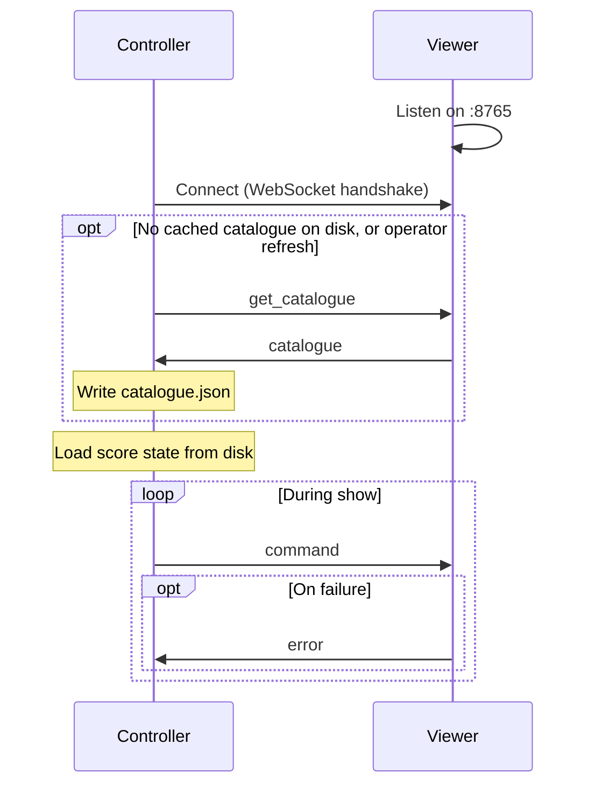
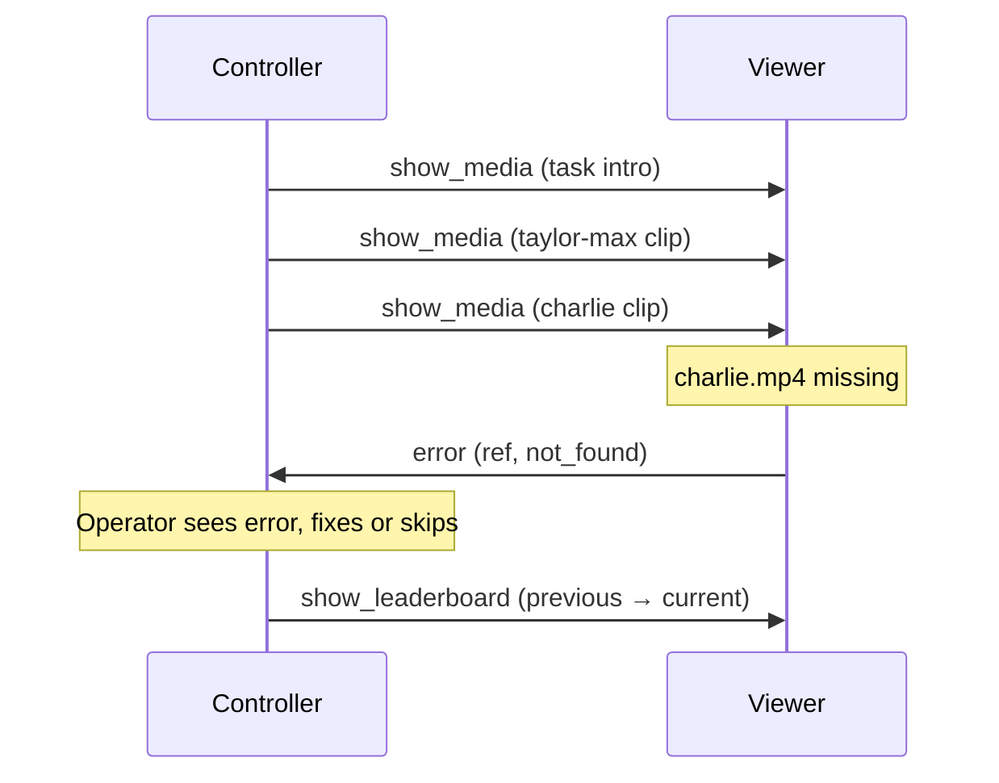

# Taskmaster Show Control System — Protocol Design

This document defines the wire protocol between the Controller and the Viewer. It expands on [§6 of the High-Level Design](high-level-design.md#6-component-interactions) and is the contract both applications are built against. Controller UI behaviour is in the [Controller design doc](controller-design.md); Viewer rendering is in the [Viewer design doc](viewer-design.md). Where the two documents disagree, the High-Level Design wins on intent and this document wins on message detail.

## 1. Scope

This protocol covers every message that crosses the network between the two applications: the catalogue request and response, the display commands the Controller sends during a show, and the errors the Viewer reports back. It does not cover on-disk formats (`show_state.json`, `contestants.json`), which are internal to each application.

### Messages at a glance

The full set of message types, so the vocabulary is visible without cross-referencing. Each is defined in detail in [§5](#5-commands-controller--viewer) and [§6](#6-messages-viewer--controller).


| Message                   | Direction | Purpose                                                                           |
| ------------------------- | --------- | --------------------------------------------------------------------------------- |
| `get_catalogue`           | C → V     | Request a scan of `media/` (only when no cache exists or the operator refreshes). |
| `show_media`              | C → V     | Show a video clip or still image full-screen.                                   |
| `background`              | C → V     | Clear the screen to the standard background.                                      |
| `show_leaderboard`        | C → V     | Show the episode leaderboard, animating previous → current.                       |
| `show_series_leaderboard` | C → V     | Show the series leaderboard, animating previous → current.                        |
| `catalogue`               | V → C     | Reply to `get_catalogue` describing everything on disk.                           |
| `error`                   | V → C     | Report that a command could not be carried out.                                   |


`C → V` is Controller to Viewer; `V → C` is Viewer to Controller.

## 2. Transport

- **Protocol:** WebSocket (RFC 6455) over the local network.
- **Server:** the Viewer listens on `ws://<viewer-host>:8765`.
- **Addressing:** the Controller connects by the Viewer's mDNS hostname (e.g. `taskmaster-viewer.local`), not by IP. macOS publishes the Mac's `*.local` name automatically over mDNS (Bonjour), and Windows 11 resolves `*.local` natively, so no configuration is needed on either machine. The hostname stays valid even when DHCP assigns the Mac a different IP, which removes IP-change handling as a concern. A raw IP address is accepted in the same connection field as a fallback for the rare network that filters mDNS. Zero-config service discovery (the Viewer advertising a `_taskmaster._tcp` service so the Controller finds it with no typing) is deferred future work.
- **Payload:** every frame is a single UTF-8 JSON text message. Binary frames are not used; media is read from the Viewer's local disk, never sent over the wire.
- **Environment:** the link runs on a trusted, offline LAN. There is no authentication, no TLS, and no origin checking, because both machines are physically controlled during recording. This is a deliberate trade-off for a closed, single-operator setup and must be revisited before any deployment that is not fully isolated. There may be other devices on the LAN but they are considered fully trusted.


### Robustness

- The Viewer must tolerate malformed input: a frame that is not valid JSON, or is missing a known `type`, is answered with an `error` and otherwise ignored. It never crashes the display.
- Messages larger than a sane limit (default 1 MiB) are rejected with an `error`. Catalogue responses are the only large messages and stay well under this.
- Unknown `type` values are answered with an `error` of code `unknown_type` and ignored, so that a newer Controller talking to an older Viewer degrades safely.


## 3. Message envelope

Every message, in both directions, is a JSON object with the same top-level shape:

```json
{
  "type": "show_media",
  "id": 42,
  "payload": { }
}
```


| Field     | Type    | Required | Description                                                                        |
| --------- | ------- | -------- | ---------------------------------------------------------------------------------- |
| `type`    | string  | yes      | The message name (see [§5](#5-commands-controller--viewer) and [§6](#6-messages-viewer--controller)). |
| `id`      | integer | no       | Controller-assigned sequence number. Lets an `error` name the command that failed. |
| `payload` | object  | yes      | Message-specific body. Present but may be empty (`{}`).                            |


The Controller assigns `id` as a monotonically increasing integer per session, starting at 1. The Viewer echoes it back in any `error` it raises for that command (as `ref`). Viewer-initiated messages (`catalogue`) carry no `id`.

## 4. Connection lifecycle




1. **Connect.** The Controller opens the WebSocket by hostname ([§2](#2-transport)). No handshake message is exchanged beyond the standard WebSocket upgrade.
2. **Catalogue.** The Controller persists the catalogue to `config/catalogue.json` and loads it from there on startup. It sends `get_catalogue` only when that file is missing or the operator triggers a refresh, then writes the reply back to disk. Because content is static, filming typically needs a single fetch for the whole week; refreshes are mainly a development convenience when media changes (see [High-Level Design §2, Static content](high-level-design.md#static-content)).
3. **Show.** The Controller sends display commands. The Viewer renders each one and stays silent unless a command fails.
4. **Disconnect.** If the socket drops, the Controller retries the connection automatically with backoff.
5. **Reconnect.** On reconnect the cached catalogue is reused — the Controller does not refetch. If the Viewer restarted it comes back on the idle background; there is no automatic state resync and no dedicated state-sync message, so the operator re-taps the action for whatever should currently be on screen and the next command repaints it.


## 5. Commands (Controller → Viewer)

All commands are fire-and-forget. A command produces a visible change on the Viewer and no reply on success.

### 5.1 `get_catalogue`

Requests a scan of the Viewer's `media/` tree. The Controller sends this only when its local `config/catalogue.json` is missing or the operator triggers a refresh; the reply is written back to that file and reused thereafter. It is not sent on every connect.

**Payload:** empty.

```json
{ "type": "get_catalogue", "id": 1, "payload": {} }
```

The Viewer responds with a `catalogue` message ([§6.1](#61-catalogue)).

### 5.2 `show_media`

Displays one media file — a video clip or a still image — full-screen. Used for the episode intro, task intros, contestant clips, and prize stills.

**Payload:**


| Field        | Type    | Required | Description                                                                 |
| ------------ | ------- | -------- | --------------------------------------------------------------------------- |
| `path`       | string  | yes      | Path to the file, relative to the Viewer's `media/` root.                  |
| `preroll`    | string  | no       | Path to a clip to play **first**, chaining straight into `path`. Used only for a task's first (video) clip; see below. |


```json
{ "type": "show_media", "id": 7, "payload": { "path": "episodes/ep01/tasks/task01/taylor-max.mp4" } }
```

The Viewer decides how to present the file from its extension.

- **Video:** plays once. When playback finishes, the Viewer returns to the standard background automatically; the Controller does not send a separate `background` command for this. If the operator sends the next command before the clip ends, playback is replaced immediately.
- **Still image:** has no natural end; the image stays on screen until the next command. There is no automatic return to the background.

**Preroll (lead-in) chaining.** When `preroll` is present, the Viewer plays that clip first and, the instant it ends, cuts **straight** into `path` — with **no** end-of-clip freeze and no black in between (the preroll's last frame holds until the main clip's first frame paints). Only the main clip's end triggers the usual return-to-background (with its 1 s final-frame hold, see [Viewer design §4.2](viewer-design.md#42-media)). The Controller uses this so the series-wide `task_lead_in` sting immediately precedes each task's first video intro without the operator having to advance ([Controller design §4.1](controller-design.md#41-playback)). `preroll` is best-effort: if the clip is missing or not a video the Viewer reports an `error` but still plays `path` alone, so the show never stalls.

Paths must stay within `media/`. The Viewer rejects any path that escapes the root (for example via `..`) with an `error` of code `bad_request`.

### 5.3 `background`

Shows the standard background explicitly. This is also where the Viewer returns automatically when a video finishes (see [§5.2](#52-show_media)). The operator can send this command directly to clear the screen between segments.

**Payload:** empty. There is a single idle background for this season, so the command takes no parameters ([Viewer design §4.1](viewer-design.md#41-background)).

```json
{ "type": "background", "id": 12, "payload": {} }
```


### 5.4 `show_leaderboard`

Shows the current **episode** leaderboard, animating each contestant from their previous total to their current total and reordering rows as needed.

**Payload:**


| Field    | Type  | Required | Description                                     |
| -------- | ----- | -------- | ----------------------------------------------- |
| `scores` | array | yes      | One entry per contestant, each with `contestant`, `previous`, and `current`. |


```json
{
  "type": "show_leaderboard",
  "id": 20,
  "payload": {
    "scores": [
      { "contestant": "taylor", "previous": 4, "current": 6 },
      { "contestant": "peter",  "previous": 3, "current": 8 }
    ]
  }
}
```

The Viewer looks up each contestant's display name and profile image from local disk by `contestant` id, animates `previous → current`, then orders rows by `current` descending. Ties are broken alphabetically by display name, matching the Controller's own ordering. The Controller is the source of the numbers; the Viewer never computes scores.

### 5.5 `show_series_leaderboard`

Identical in shape and behaviour to `show_leaderboard`, but shows cumulative **series** standings across episodes. `previous` is the point to animate from and `current` the point to animate to; the Controller derives both from its per-episode state ([Controller design §4.4](controller-design.md#44-post-display)), and the Viewer animates between them exactly as for the episode board without needing to know how they were computed.

```json
{
  "type": "show_series_leaderboard",
  "id": 33,
  "payload": {
    "scores": [
      { "contestant": "taylor", "previous": 88, "current": 105 },
      { "contestant": "peter",  "previous": 91, "current": 99 }
    ]
  }
}
```


## 6. Messages (Viewer → Controller)

The Viewer sends exactly two kinds of message: the catalogue reply, and errors.

### 6.1 `catalogue`

Sent only in response to `get_catalogue`. Describes the media the Controller can send via `show_media`, and the contestant ids and display names the Controller needs for its UI. Profile images are not included — the Viewer resolves those from local disk when rendering a leaderboard (see [§5.4](#54-show_leaderboard)). Paths in the catalogue are relative to the Viewer's `media/` root.

The example below is **illustrative and abbreviated** — the shipped fixtures have more steps than shown (e.g. `task00_prize` lists all five entries). It shows the shape, not a literal mirror of any episode.

```json
{
  "type": "catalogue",
  "payload": {
    "contestants": [
      { "id": "taylor", "name": "Taylor" },
      { "id": "max",    "name": "Max" },
      { "id": "charlie", "name": "Charlie" },
      { "id": "peter",  "name": "Peter" },
      { "id": "harry",  "name": "Harry" }
    ],
    "intros": [
      { "clip": "sting-classic",  "path": "assets/intros/sting-classic.mp4" },
      { "clip": "sting-dramatic", "path": "assets/intros/sting-dramatic.mp4" }
    ],
    "intro": "series/intro.mp4",
    "outro": "series/outro.mp4",
    "task_lead_in": "series/task-lead-in.mp4",
    "episodes": [
      {
        "id": "ep01",
        "opening_bit": { "text": "Welcome the crowd, then hand over to the Taskmaster." },
        "tasks": [
          {
            "id": "task00_prize",
            "steps": [
              { "text": "Prize task: bring the most impressive item." },
              { "clip": "charlie", "path": "episodes/ep01/tasks/task00_prize/charlie.jpg", "text": "Charlie brought his dog." },
              { "text": "Overall: Charlie 1st, Taylor 2nd." }
            ]
          },
          {
            "id": "task01",
            "steps": [
              { "text": "Throw a frog the furthest." },
              {
                "clip": "intro",
                "path": "episodes/ep01/tasks/task01/intro.mp4",
                "text": "One throw each. Stay behind the line."
              },
              {
                "clip": "taylor-max",
                "path": "episodes/ep01/tasks/task01/taylor-max.mp4",
                "text": "Taylor 31 m, Max 12 m."
              },
              {
                "clip": "peter-harry",
                "path": "episodes/ep01/tasks/task01/peter-harry.mp4",
                "text": "Peter 28 m, Harry's frog escaped."
              },
              { "text": "Overall: Peter 1st, Taylor 2nd." }
            ]
          }
        ],
        "live_task": { "text": "Keep the balloon airborne with only a spoon. 100 seconds." }
      }
    ]
  }
}
```

**Discovery rules the Viewer follows when building the catalogue:**

- **Contestants** come from `contestants.json`. Only `id` and `name` are sent; profile images stay on the Viewer.
- **Intro pool** — every file in `assets/intros/` is listed in the top-level `intros` array (`clip` = filename without extension, plus its `path`). The Controller uses this pool to pick a clip for a random task intro (see the intro-step rule below); the Viewer never chooses. (This is distinct from the single series-wide `intro` clip below.)
- **Series-wide clips** — three clips are shared by the whole season and live under `media/series/`, resolved by base name (any recognised extension): `series/intro.<ext>` → top-level `intro` (the opening titles, played once per episode), `series/outro.<ext>` → top-level `outro` (the closing sequence), and `series/task-lead-in.<ext>` → top-level `task_lead_in` (the sting that precedes every task's first video clip, chained via `show_media`'s `preroll`, see [§5.2](#52-show_media)). Each is optional and omitted from the catalogue when absent; the Controller disables the matching action / skips the preroll accordingly.
- **Episodes** are the sub-folders of `media/episodes/`, ordered alphabetically by folder name; the folder name is the episode `id`.
- **Episode text metadata** — every episode must contain `opening-bit.json` and `live-task.json` at its root, each of the form `{ "text": "…" }`. The Viewer reads both and inlines them into the catalogue as the `opening_bit` and `live_task` objects on the episode. The Controller cannot read the Viewer's disk, so this is the only way it obtains that text ([Controller design §3.3, §5, §8](controller-design.md)). A missing file is a fatal catalogue error the Viewer logs; both are required because every episode has an opening bit and a live task.
- **Field order** — the top-level catalogue lists `contestants`, `intros`, then the series-wide `intro`, `outro`, `task_lead_in`, then `episodes`. Each episode object lists its fields in show order: `id`, `opening_bit`, `tasks`, `live_task`. The `live_task` sits **after** `tasks` because the live task runs after all pre-recorded tasks. (The intro/outro are no longer per-episode.)
- **Tasks** are the sub-folders of `episodes/<id>/tasks/`, ordered alphabetically by folder name; the folder name is the task `id`. The prize task uses id `task00_prize`.
- **Task steps** — each task folder must contain `results.json` with a `steps` array (≥2 entries). The first step must be text-only (no `clip`). Steps are processed in array order. Each step includes `text`. If a step has `clip`, resolve it to the matching file in the same folder (`<clip>.mp4`, `<clip>.mov`, `<clip>.jpg`, …) and add `path` to the catalogue entry. Labels are unique within a task folder — no two files share a label — so the match is unambiguous. Media files in the folder that no step references are ignored (they never appear in the catalogue). Text-only steps (no `clip`) are optional and passed through in array order; by convention the first step is a briefing and the last step carries the overall rankings, but neither is required ([Controller design §2](controller-design.md#2-task-structure-resultsjson)). The catalogue exposes the full ordered `steps` array on each task object.
- **Intro steps** — a step with the reserved label `"clip": "intro"` resolves specially: (1) if the task folder has its own `intro.<ext>`, that path is used; (2) else if the step has `"intro": "<name>"`, the pool clip `assets/intros/<name>.<ext>` is used; (3) otherwise the step is exposed as `{ "clip": "intro", "random_intro": true, "text": … }` with **no** `path` — the Controller picks a clip from the `intros` pool at play time and sends its `path` via `show_media`.


### 6.2 `error`

Reports that a command could not be carried out. Shown to the operator on the Controller; never shown on the TV.

**Payload:**


| Field     | Type           | Required | Description                                              |
| --------- | -------------- | -------- | -------------------------------------------------------- |
| `ref`     | integer \| null | yes      | The `id` of the command that failed, or null if unknown. |
| `command` | string         | no       | The `type` of the failed command, for readability.       |
| `code`    | string         | yes      | Machine-readable error code (see below).                 |
| `message` | string         | yes      | Human-readable detail for the operator.                  |


```json
{
  "type": "error",
  "payload": {
    "ref": 7,
    "command": "show_media",
    "code": "not_found",
    "message": "File not found: episodes/ep01/tasks/task01/charlie.mp4"
  }
}
```

**Error codes:**


| Code                | Meaning                                                        |
| ------------------- | -------------------------------------------------------------- |
| `not_found`         | A referenced path does not exist on the Viewer.                |
| `unsupported_media` | The file exists but cannot be played or shown.                 |
| `bad_request`       | The payload is malformed, or a path escapes the `media/` root. |
| `unknown_type`      | The `type` is not a recognised command.                        |
| `too_large`         | The incoming message exceeded the size limit.                  |
| `internal`          | An unexpected Viewer-side failure.                             |


## 7. Worked example: one task

The command sequence for a single task, showing the one error path.




## 8. Versioning

The protocol is unversioned for the single static season this project targets. If a second season or a breaking change ever arrives, add a `protocol` version field to the WebSocket handshake (as a query parameter) and negotiate on connect. Until then, the `unknown_type` rule ([§2](#2-transport)) is the only forward-compatibility mechanism and is sufficient.