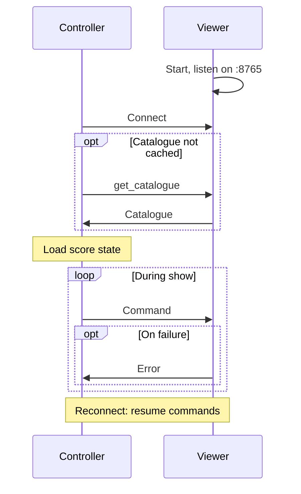
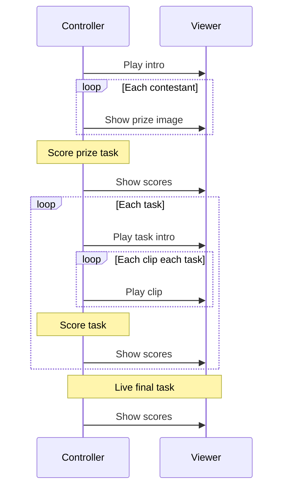
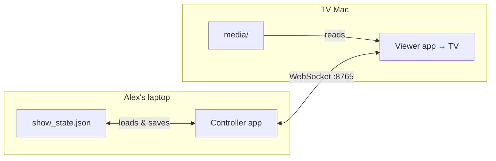

# Taskmaster Show Control System — High Level Design

## 1. Requirements

### Summary

This application replicates the functionality of the "Alex's iPad" used during the studio portions of Taskmaster.

The system consists of two desktop applications on a local network:

- **Controller** — operated by the host ("Alex"). It is private; only the operator sees it.
- **Viewer** — an application that plays media, displayed full-screen on the TV for the audience.

The Controller owns **runtime show state** (scores, progression, what's on screen). The Viewer renders commands and can describe its available content when the Controller asks.

### How a show runs

1. Start the Viewer, then the Controller.
2. The Controller connects and requests a **catalogue** from the Viewer if it does not already have one cached.
3. The operator runs through the episode in order: intro, prize task, initial scores, then for each task — intro, clips, score update — and final scores. See [§3](#example-episode-flow) for the full sequence.
4. During the show, the Viewer sends messages to the Controller only when something fails.

The system runs entirely offline on local WiFi. No internet connection is required during a show.

### Development and deployment

The repo is developed on one machine and copied to two for the show:

- `controller/` → Alex's Windows 11 laptop (folded back as the iPad)
- `viewer/` → Mac connected to the TV via HDMI (extended display)

Episode content is preloaded on the Viewer before recording. The Controller holds score state only.

### Scope: one static season

This project targets one season with a fixed set of episodes, contestants, and media. The repo is expected to be largely static once complete. There is no need to support adding episodes mid-season, downloading clips on demand, or managing multiple concurrent seasons.

See [§2 Design Principles](#2-design-principles) for architectural rationale, including catalogue and messaging policy.

## 2. Design Principles

This section records the principles behind key decisions. If a future change conflicts with one of these, treat it as a deliberate trade-off.

### Viewer-first quality

The **Viewer** is what the audience sees, so animations, video, and the leaderboard must be correct and polished. The **Controller** only needs to be clear and usable by the operator; it does not need to look sleek, because nobody else will see it, but it does need to be correct and usable, because usability delays will be evident when the Viewer does not receive the right command at the right time.

### Controller commands, Viewer renders

All scoring, ordering, and show progression live in the Controller. The Viewer executes commands deterministically and never makes decisions on its own. The Controller always knows the current episode, task, scores, and what is on screen.

### Viewer owns content; Controller owns show state

Episode media and structure live on the Viewer; the Controller stores only mutable score state on its local disk. Commands reference media by path and the Viewer loads files locally — nothing is streamed or duplicated onto the Controller.

### Static content

The media tree is fixed for the season: everything the Viewer can display exists on disk before recording and does not change while the show runs. Content is read-only at show time, which is what lets the Controller treat the catalogue as a one-time lookup rather than live data (see [§6](#6-component-interactions)).

### Errors required, not acknowledgements

During a show, commands are fire-and-forget. The operator watches the TV, so a successful command needs no reply. The Viewer sends a message to the Controller only on failure — missing file, playback error, invalid state. The sole exception is a catalogue response to an explicit `get_catalogue` request at setup; that is not an acknowledgement of routine commands.

### Viewer hosts the WebSocket server

The Viewer listens on port `8765` and the Controller connects as a client when the operator is ready.

### Episodes as first-class units

Each episode is a recording session with its own tasks and scores in `episodes/<id>/show_state.json`. Series standings for the season live in a separate `show_state.json` at the config root (see [§5](#scores)).

### Convention over configuration

Tasks and clips are discovered from the folder structure and filenames. There is no per-task JSON and no episode metadata files. Contestants are defined once for the whole season.

## 3. High-Level Architecture

Both applications run on separate machines connected over local WiFi. The following sequence diagram shows **connect and reconnect**, and the high-level interactions between the applications.




### Example episode flow

Within this, a typical studio episode largely consists of the following command flows between the Controller and the Viewer. Note the sending of errors is omitted for brevity.




This matches the usual Taskmaster studio recording: prize task, pre-recorded tasks, live tasks, final leaderboard.

## 4. Technology Stack


| Layer       | Choice                         |
| ----------- | ------------------------------ |
| Language    | Python 3.12+                   |
| GUI         | PySide6 (Qt)                   |
| Networking  | WebSockets                     |
| Data format | JSON                           |
| Media       | Local files on the Viewer only |


---

## 5. Data & Content

Each application is a self-contained deploy unit, cloned to its target machine before recording. The Controller holds **score state** — a season `show_state.json` and one per episode — that is liable to change. The Viewer holds **static** **media** (clips, assets, and the season `contestants.json`). See [§2](#viewer-owns-content-controller-owns-show-state). Score state and media are not synced over the network at show time.




### Folder layout

```
controller/
  src/
  config/
    show_state.json           # season series scores
    episodes/
      ep01/show_state.json
      ep02/show_state.json

viewer/
  src/
  media/
    contestants.json
    assets/
      contestants/          # alice.png, bob.png, ...
      logos/
      backgrounds/
      sounds/
    episodes/
      ep01/
        intro.mp4
        prize/                # one still per contestant
        tasks/
          task01/             # intro.mp4, alice.mp4, ...
          task02/
      ep02/
        ...
```


| Location                                      | Purpose                                |
| --------------------------------------------- | -------------------------------------- |
| `controller/config/show_state.json`           | Season series scores                   |
| `controller/config/episodes/<id>/`            | Scores and progress for that episode   |
| `viewer/media/episodes/<id>/intro.mp4`        | Episode opening clip                   |
| `viewer/media/episodes/<id>/prize/`           | Prize task stills (one per contestant) |
| `viewer/media/episodes/<id>/tasks/<task-id>/` | Video clips for one task               |
| `viewer/media/contestants.json`               | Season cast, shared across episodes    |
| `viewer/media/assets/`                        | Shared images, logos, and sounds       |


### Episodes

An episode is a folder under `viewer/media/episodes/` (e.g. `ep01`). The folder name is the episode id. Scores for each episode are stored in `controller/config/episodes/<id>/show_state.json`.

### Contestants

The season cast is defined in a single `contestants.json` on the Viewer. The same contestants appear in every episode. Profile images live in `assets/contestants/`.

### Tasks and clips

Each task is a folder under `episodes/<id>/tasks/`. The folder name is the task id, and the video files inside are the clips. Clip labels are derived from the filename without its extension. The Viewer discovers this structure by scanning directories.

### Scores

**Episode scores** — each episode maintains two score sets: **previous totals** (cumulative scores before the current task) and **task scores** (points for the current task only). Combined totals are derived when the leaderboard is shown. State is persisted in `episodes/<id>/show_state.json`. When two contestants have the same total, ties are broken alphabetically by display name.

**Series scores** — the season maintains the same two-set pattern in `config/show_state.json`: **previous totals** (the standings last shown on the series leaderboard) and **current totals** (the standings to display now). When the operator sends `show_series_leaderboard`, the Viewer animates from previous to current; the Controller then commits previous to match current and persists. Series previous totals are updated only at that point, not when current totals are edited elsewhere.

---

## 6. Component interactions

Wire-level detail for the interactions in [§2](#2-design-principles) and [§3](#3-high-level-architecture). [§5](#5-data--content) describes what each side stores on disk.

### Connection lifecycle


| Phase      | Flow                                                       |
| ---------- | ---------------------------------------------------------- |
| Connect    | Connect; `get_catalogue` if needed; load season and episode `show_state.json` |
| Show       | Commands from Controller; `error` from Viewer on failure   |
| Disconnect | Controller retries automatically                           |
| Reconnect  | Reconnect; cached catalogue reused; operator resends commands as needed |


Because content is static ([§2](#static-content)), the Viewer is the source of truth for what is on disk at the TV machine, but that truth does not change during a show. The Controller therefore fetches the catalogue once with `get_catalogue`, caches it for the session, and reuses it across reconnects rather than refetching. There is no push on connect and no live sync of content.


### Commands (Controller → Viewer)

The example episode flow in §3 uses plain-language labels. Detailed behaviour is covered in the Controller and Viewer design docs.


| Command                   | Purpose                                                              |
| ------------------------- | -------------------------------------------------------------------- |
| `get_catalogue`           | Request a scan of `media/`                                           |
| `show_media`              | Play a video or show a still image by path                           |
| `background`              | Show a background screen                                             |
| `show_leaderboard`        | Show episode leaderboard, animating from previous to current totals  |
| `show_series_leaderboard` | Show series leaderboard, animating from previous to current totals |


Intro, task intro, and contestant clips use `show_media`; prize images use `show_media` with still paths; episode score displays use `show_leaderboard`; series standings use `show_series_leaderboard`.

### Operator actions (Controller only)

Some steps in the episode flow do not send a message to the Viewer. The operator enters scores on the Controller after the prize images and after each task's clips. Score state is persisted and advanced locally; the Viewer is updated when the operator sends the next display command.

### Viewer rendering

Only one display mode is active at a time; the layout scales to the connected display. Modes include background, media playback, episode leaderboard, and series leaderboard.

### Messages (Viewer → Controller)


| Type        | Purpose                  |
| ----------- | ------------------------ |
| `catalogue` | Reply to `get_catalogue` |
| `error`     | Command failed           |


The full message schema is defined in the protocol design doc.

---

## 7. Future Features

These are deferred unless a concrete need arises: sound effects, countdown timer, cue stack, keyboard shortcuts, multiple displays, OBS integration, undo, and video-ended events.

## 8. Guiding Principle

When in doubt, refer to [§2 Design Principles](#2-design-principles) before changing the split of responsibilities between the two apps.