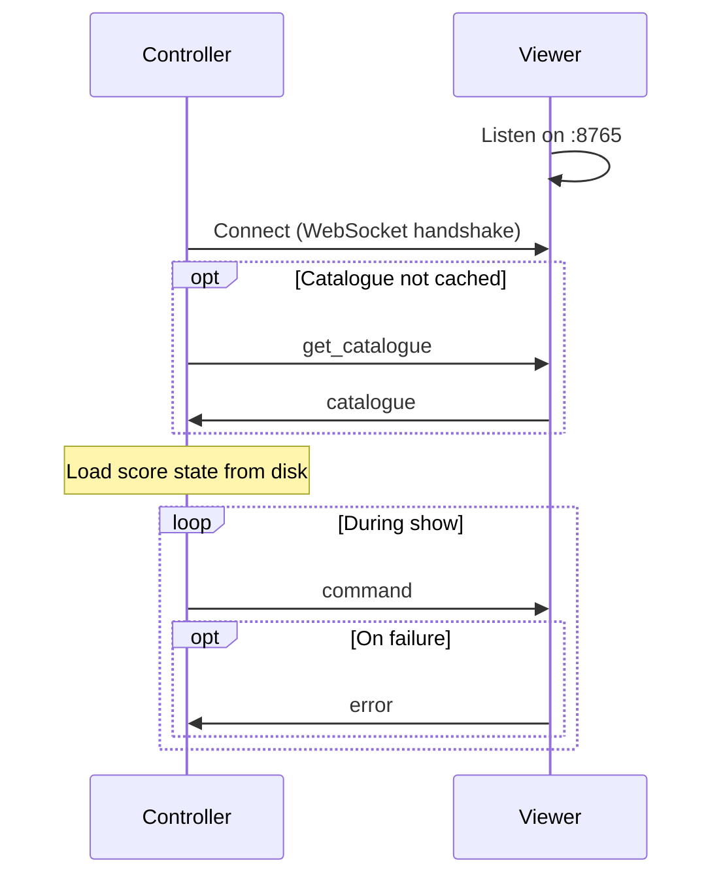
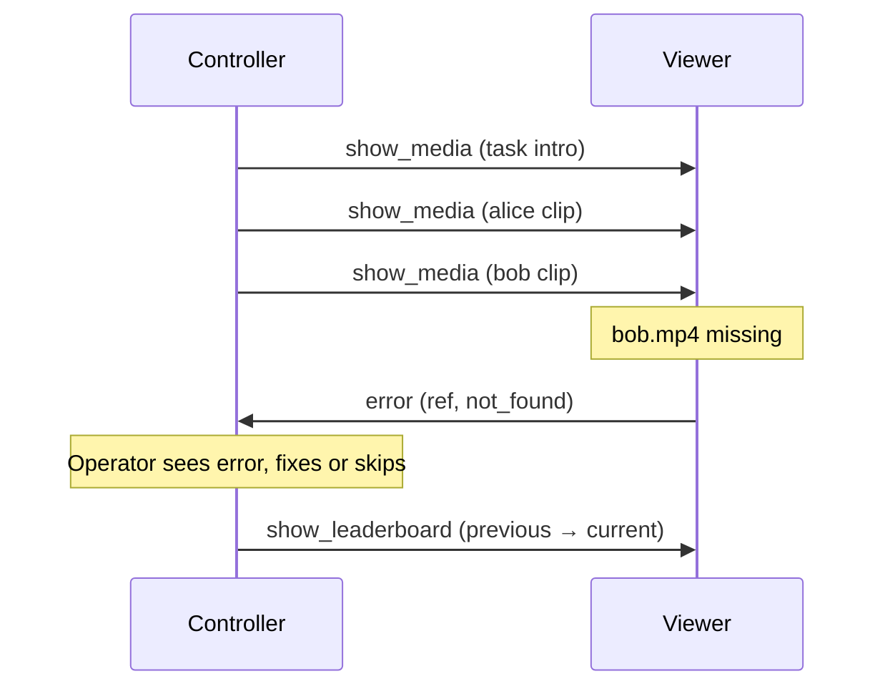

# Taskmaster Show Control System — Protocol Design

This document defines the wire protocol between the Controller and the Viewer. It expands on [§6 of the High-Level Design](high-level-design.md#6-component-interactions) and is the contract both applications are built against. Where the two documents disagree, the High-Level Design wins on intent and this document wins on message detail.

## 1. Scope

This protocol covers every message that crosses the network between the two applications: the catalogue request and response, the display commands the Controller sends during a show, and the errors the Viewer reports back. It does not cover on-disk formats (`show_state.json`, `contestants.json`), which are internal to each application.

## 2. Transport

- **Protocol:** WebSocket (RFC 6455) over the local network.
- **Server:** the Viewer listens on `ws://<viewer-ip>:8765`. The Controller connects as a client to a manually entered address.
- **Payload:** every frame is a single UTF-8 JSON text message. Binary frames are not used; media is read from the Viewer's local disk, never sent over the wire.
- **Environment:** the link runs on a trusted, offline LAN. There is no authentication, no TLS, and no origin checking, because both machines are physically controlled during recording. This is a deliberate trade-off for a closed, single-operator setup and must be revisited before any deployment that is not fully isolated.

### Robustness

- The Viewer must tolerate malformed input: a frame that is not valid JSON, or is missing a known `type`, is answered with an `error` and otherwise ignored. It never crashes the display.
- Messages larger than a sane limit (default 1 MiB) are rejected with an `error`. Catalogue responses are the only large messages and stay well under this.
- Unknown `type` values are answered with an `error` of code `unknown_type` and ignored, so that a newer Controller talking to an older Viewer degrades safely.

## 3. Message envelope

Every message, in both directions, is a JSON object with the same top-level shape:

```json
{
  "type": "show_media",
  "id": 42,
  "payload": { }
}
```

| Field     | Type    | Required | Description                                                                 |
| --------- | ------- | -------- | --------------------------------------------------------------------------- |
| `type`    | string  | yes      | The message name (see §5 and §6).                                           |
| `id`      | integer | no       | Controller-assigned sequence number. Lets an `error` name the command that failed. |
| `payload` | object  | yes      | Message-specific body. Present but may be empty (`{}`).                     |

The Controller assigns `id` as a monotonically increasing integer per session, starting at 1. The Viewer echoes it back in any `error` it raises for that command (as `ref`). Viewer-initiated messages (`catalogue`) carry no `id`.

## 4. Connection lifecycle



1. **Connect.** The Controller opens the WebSocket. No handshake message is exchanged beyond the standard WebSocket upgrade.
2. **Catalogue.** If the Controller has no cached catalogue for the session, it sends `get_catalogue` and waits for the `catalogue` reply before enabling the show UI. Because content is static, this happens at most once per session (see [High-Level Design §2, Static content](high-level-design.md#static-content)).
3. **Show.** The Controller sends display commands. The Viewer renders each one and stays silent unless a command fails.
4. **Disconnect.** If the socket drops, the Controller retries the connection automatically with backoff.
5. **Reconnect.** On reconnect the cached catalogue is reused — the Controller does not refetch. The Viewer starts from a blank/background state, so the Controller resends the command for whatever should currently be on screen. There is no dedicated state-sync message.

## 5. Commands (Controller → Viewer)

All commands are fire-and-forget. A command produces a visible change on the Viewer and no reply on success.

### 5.1 `get_catalogue`

Requests a scan of the Viewer's `media/` tree. Sent at most once per session.

**Payload:** empty.

```json
{ "type": "get_catalogue", "id": 1, "payload": {} }
```

The Viewer responds with a `catalogue` message (§6.1).

### 5.2 `show_media`

Displays one media file — a video clip or a still image — full-screen. Used for the episode intro, task intros, contestant clips, and prize stills.

**Payload:**

| Field   | Type    | Required | Description                                                              |
| ------- | ------- | -------- | ------------------------------------------------------------------------ |
| `path`  | string  | yes      | Path to the file, relative to the Viewer's `media/` root.                |
| `loop`  | boolean | no       | For video, whether to loop until the next command. Default `false`.      |

```json
{ "type": "show_media", "id": 7, "payload": { "path": "episodes/ep01/tasks/task01/alice.mp4" } }
```

The Viewer decides how to present the file from its extension: video extensions play; image extensions are shown as a still until the next command. A still image has no natural end, so it remains until replaced. A video plays once (unless `loop` is set) and holds on its final frame when finished; the Controller decides what to show next.

Paths must stay within `media/`. The Viewer rejects any path that escapes the root (for example via `..`) with an `error` of code `bad_request`.

### 5.3 `background`

Clears any media or leaderboard and shows a neutral background. This is the resting state between segments.

**Payload:**

| Field  | Type   | Required | Description                                                                              |
| ------ | ------ | -------- | ---------------------------------------------------------------------------------------- |
| `name` | string | no       | Name of a background in `assets/backgrounds/` (without extension). Omit for the default. |

```json
{ "type": "background", "id": 12, "payload": {} }
```

### 5.4 `show_leaderboard`

Shows the current **episode** leaderboard, animating each contestant from their previous total to their current total and reordering rows as needed.

**Payload:**

| Field    | Type  | Required | Description                                     |
| -------- | ----- | -------- | ----------------------------------------------- |
| `scores` | array | yes      | One entry per contestant (see the scores type). |

```json
{
  "type": "show_leaderboard",
  "id": 20,
  "payload": {
    "scores": [
      { "contestant": "alice", "previous": 12, "current": 17 },
      { "contestant": "bob",   "previous": 15, "current": 15 }
    ]
  }
}
```

The Viewer looks up each contestant's display name and image from the cached catalogue by `contestant` id, animates `previous → current`, then orders rows by `current` descending. Ties are broken alphabetically by display name, matching the Controller's own ordering. The Controller is the source of the numbers; the Viewer never computes scores.

### 5.5 `show_series_leaderboard`

Identical in shape and behaviour to `show_leaderboard`, but shows cumulative **series** standings across episodes. The `previous` values are the standings last shown on the series leaderboard; `current` are the standings to show now. The Viewer animates between them the same way.

```json
{
  "type": "show_series_leaderboard",
  "id": 33,
  "payload": {
    "scores": [
      { "contestant": "alice", "previous": 88, "current": 105 },
      { "contestant": "bob",   "previous": 91, "current": 99 }
    ]
  }
}
```

## 6. Messages (Viewer → Controller)

The Viewer sends exactly two kinds of message: the catalogue reply, and errors.

### 6.1 `catalogue`

Sent only in response to `get_catalogue`. Describes everything on the Viewer's disk that the Controller can reference. All paths are relative to the Viewer's `media/` root.

```json
{
  "type": "catalogue",
  "payload": {
    "contestants": [
      { "id": "alice", "name": "Alice", "image": "assets/contestants/alice.png" },
      { "id": "bob",   "name": "Bob",   "image": "assets/contestants/bob.png" }
    ],
    "episodes": [
      {
        "id": "ep01",
        "intro": "episodes/ep01/intro.mp4",
        "prize": [
          { "contestant": "alice", "image": "episodes/ep01/prize/alice.png" },
          { "contestant": "bob",   "image": "episodes/ep01/prize/bob.png" }
        ],
        "tasks": [
          {
            "id": "task01",
            "intro": "episodes/ep01/tasks/task01/intro.mp4",
            "clips": [
              { "contestant": "alice", "label": "alice", "path": "episodes/ep01/tasks/task01/alice.mp4" },
              { "contestant": "bob",   "label": "bob",   "path": "episodes/ep01/tasks/task01/bob.mp4" }
            ]
          }
        ]
      }
    ]
  }
}
```

**Discovery rules the Viewer follows when building the catalogue:**

- **Contestants** come from `media/contestants.json`. The `id` is the stable key used everywhere else in the protocol.
- **Episodes** are the sub-folders of `media/episodes/`, ordered alphabetically by folder name; the folder name is the episode `id`.
- **Prize stills** are the files in `episodes/<id>/prize/`. Each file's name (without extension) must match a contestant `id`; that is how a still maps to a contestant. Files that do not match a known contestant are ignored and reported once per catalogue build as a non-fatal warning in the Viewer's own log (not over the wire).
- **Tasks** are the sub-folders of `episodes/<id>/tasks/`, ordered alphabetically; the folder name is the task `id`.
- **Clips** are the video files inside a task folder. `label` is the filename without extension. A file named after a contestant `id` is additionally tagged with that `contestant`; other files (for example a shared `intro.mp4`) have a `label` but no `contestant`. The task `intro`, if present, is surfaced separately as shown above.

### 6.2 `error`

Reports that a command could not be carried out. Shown to the operator on the Controller; never shown on the TV.

**Payload:**

| Field     | Type            | Required | Description                                            |
| --------- | --------------- | -------- | ------------------------------------------------------ |
| `ref`     | integer \| null | yes      | The `id` of the command that failed, or null if unknown. |
| `command` | string          | no       | The `type` of the failed command, for readability.     |
| `code`    | string          | yes      | Machine-readable error code (see below).               |
| `message` | string          | yes      | Human-readable detail for the operator.                |

```json
{
  "type": "error",
  "payload": {
    "ref": 7,
    "command": "show_media",
    "code": "not_found",
    "message": "File not found: episodes/ep01/tasks/task01/alice.mp4"
  }
}
```

**Error codes:**

| Code             | Meaning                                                                 |
| ---------------- | ---------------------------------------------------------------------- |
| `not_found`      | A referenced path does not exist on the Viewer.                        |
| `unsupported_media` | The file exists but cannot be played or shown.                     |
| `bad_request`    | The payload is malformed, or a path escapes the `media/` root.         |
| `unknown_type`   | The `type` is not a recognised command.                               |
| `too_large`      | The incoming message exceeded the size limit.                         |
| `internal`       | An unexpected Viewer-side failure.                                     |

## 7. Worked example: one task

The command sequence for a single task, showing the one error path.



## 8. Versioning

The protocol is unversioned for the single static season this project targets. If a second season or a breaking change ever arrives, add a `protocol` version field to the WebSocket handshake (as a query parameter) and negotiate on connect. Until then, the `unknown_type` rule (§2) is the only forward-compatibility mechanism and is sufficient.
